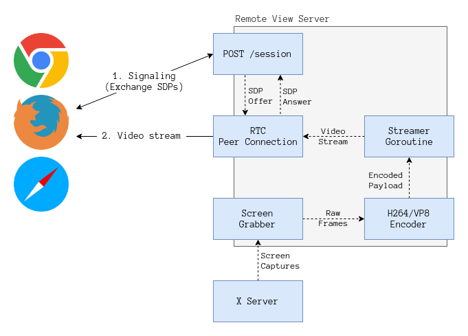
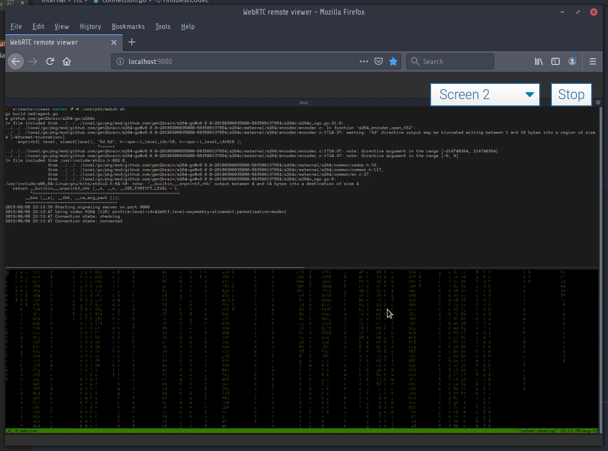

## WebRTC remote view

### Dependencies

- [Go 1.12](https://golang.org/doc/install)
- libx264

### Architecture



More info in [this blog post](https://viscarra.dev/post/webrtc-remote-screen/). 

### Running the server

The server receives the following flags through the command line:

`--http.port` (Optional) 

Specifies the port where the HTTP server should listen, by default the port 9000 is used.

`--stun.server` (Optional)

Allows to speficy a different [STUN](https://es.wikipedia.org/wiki/STUN) server, by default a Google STUN server is used.

### Usage

Chrome 74+, Firefox 66+, Safari 12.x are supported. Older versions (within reason) should be supported as well but YMMV.

Build the _deployment_ package by runnning `make`. This should create a tar file with the 
binary and web directory.

Copy the archive to a remote server, decompress it and run `./agent`. The `agent` application assumes the web dir. is in the same directory. 

WebRTC requires a _secure_ domain to work, the recommended approach towards this is to forward the agent port thru SSH tunneling:

```bash
ssh -L YOUR_LOCAL_PORT:localhost:9000 
```

Then access the application on `http://localhost:YOUR_LOCAL_PORT`, localhost should be considered 
secure by modern browsers.

### Screenshot



### Feature requests

I'll see what I can do, create an issue!

### License

MIT - see [LICENSE](LICENSE) for the full text.